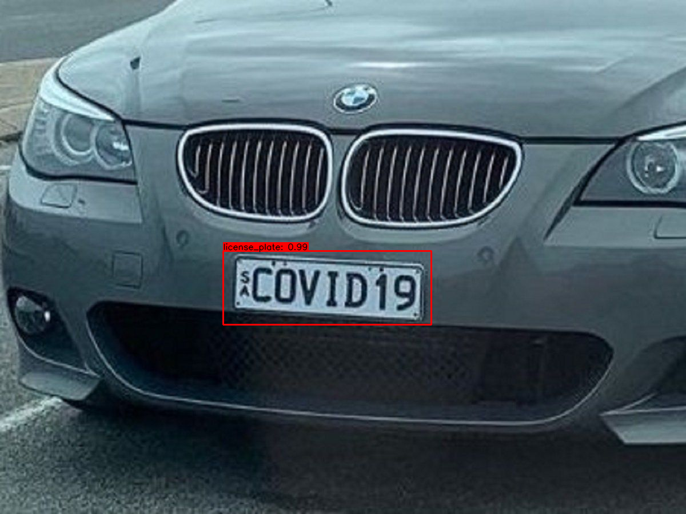
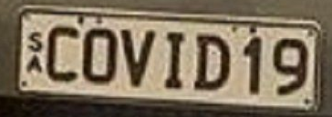

# Object Detection and OCR 
[](LICENSE)

This project implement object detection with YOLOv4 and tensorflow. YOLOv4 use deep convolutional neural network to object object detection. I take the initiave use this library to perform detection, the OCR on lisence plate, and crop the detection.

Here the Result of the project after perform the ocr and vehicle detection using th is library.

## Lisence Plate Detection and OCR

##### detect car license plate
<p align="center"></p>

##### Crop the detection
<p align="center"></p>

##### Use Tesseract to extract text from image

:covid19)


## Getting Started
To get started, yyou are required to install the dependencies via pip. In this project we are using Google Colab as a platform to complete this projects. 

### Prerequisites
* Tensorflow 2.3.0rc0
* pytesseract
* opencv


## Download pre-trained YOLOv4 weights.

My object detection uses YOLOv4 to perform the detection. I am using the existing pre-trained model (YOLOv4) that able to detect the car plate and vehicle. Attachment below is the link to download the model for car plate detection and vehicle detection. 

License Plate Detection : https://drive.google.com/file/d/1EUPtbtdF0bjRtNjGv436vDY28EN5DXDH/view?usp=sharing

Car Detection : https://drive.google.com/open?id=1cewMfusmPjYWbrnuJRuKhPMwRe_b9PaT


### To run the program, you may copy the syntax i provided below

```bash
python detect.py --weights ./checkpoints/yolov4-tiny-416 --size 416 --model yolov4 --image 'YOUR DATA' 
```


### Todo

* [x] Detect the license plate
* [x] Crop the Detection
* [x] Perform the OCR on detection
* [ ] Perform the OCR on PDF file


### References

   My project is inspired by these previous fantastic YOLOv4 implementations:
  * [Yolov4 tflite](https://github.com/hunglc007/tensorflow-yolov4-tflite)
  
