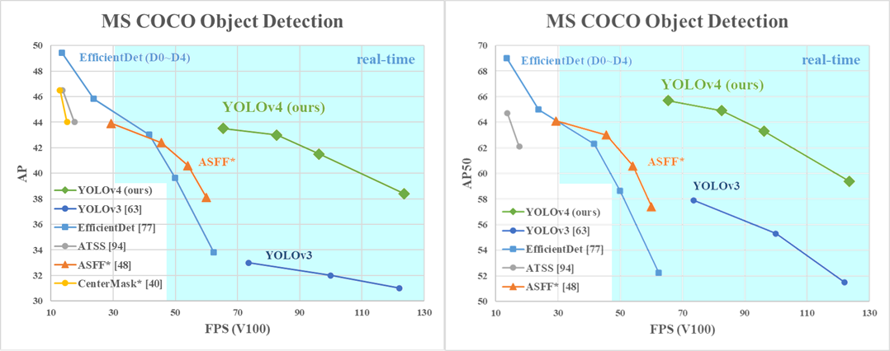

# Object Detection and OCR using YOLOv4 and tesseract
[](LICENSE)

YOLOv4, YOLOv4-tiny Implemented in Tensorflow 2.0. 
Convert YOLO v4, YOLOv3, YOLO tiny .weights to .pb, .tflite and trt format for tensorflow, tensorflow lite, tensorRT.

Download yolov4.weights file: https://drive.google.com/file/d/1EUPtbtdF0bjRtNjGv436vDY28EN5DXDH/view?usp=sharing


### Prerequisites
* Tensorflow 2.3.0rc0
* pytesseract
* opencv

### Performance
<p align="center"></p>

### copy the following syntax to run in terminal or cloud

```bash
# Convert darknet weights to tensorflow
## yolov4
python save_model.py --weights ./data/yolov4.weights --output ./checkpoints/yolov4-416 --input_size 416 --model yolov4 


python detect.py --weights ./checkpoints/yolov4-tiny-416 --size 416 --model yolov4 --image 'YOUR DATA' 

```
If you want to run yolov3 or yolov3-tiny change ``--model yolov3`` in command

#### Output

##### Yolov4 of this project
<p align="center"></p>

##### the cropping of the project
<p align="center"></p>


##### Final output of this project

:covid19)


### References

   My project is inspired by these previous fantastic YOLOv4 implementations:
  * [Yolov4 tflite](https://github.com/hunglc007/tensorflow-yolov4-tflite)
  
